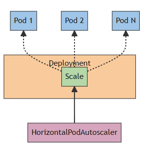

# HPA (Horizontal Pod Autoscaling)
En Kubernetes un HPA se encarga de actualizar de maner automática un tipo de recurso de carga de trabajo como Deployments o StatefulSet. Dado que es un escalamiento horizontal la idea es hacer deploys de más pods de k8s, , a diferencia del escalamiento vertical, que buscaría mejorar los recursos (como CPU) de los pods.



Para configurar el  escalamiento HPA de un deployment se utiliza ```kubectl autoscale``` donde se especifíca, *el deployment objetivo, el umbral de CPU, y el número mínimo y máximo de pods*:
```bash
kubectl autoscale deployment <nombre-deployment> --cpu-percent=10 --min=2 --max=5
```

Para verificar la existencia del HPA:
```bash
kubectl get hpa
```

Si se desea aplicar a través de un archivo YAML, la estructura esperada es:
```yml
apiVersion: autoscaling/v1
kind: HorizontalPodAutoscaler
metadata:
  name: mi-hpa
spec:
  scaleTargetRef:
    apiVersion: apps/v1
    kind: Deployment
    name: nombre-deployment
  minReplicas: 2 #mínimo de replicas
  maxReplicas: 5 #máxmio de replicas
  targetCPUUtilizationPercentage: 10 #umbral de CPU
```

Para ver este HPA en específico:
```bash
kubectl get hpa mi-hpa
```

Si se usa un YAML, la implementación/aplicación del archivo se realiza con:
```bash
kubectl apply -f mi-hpa.yaml
```

## Metrics Server
El metrics server recopila las métricas de los pods y nodos (como la memoria o CPU) que el HPA toma como base para el escalado. Instalarlo y usarlo puede ser una buena práctica para verificar el funcionamiento de HPA:
```bash
# Verificación de presencia
kubectl get deployment metrics-server

# Instalación de metrics server
helm repo add metrics-server https://kubernetes-sigs.github.io/metrics-server/

# Instalación de chart
helm upgrade --install metrics-server metrics-server/metrics-server

# Verificación de funcionamiento
kubectl top nodes
```
